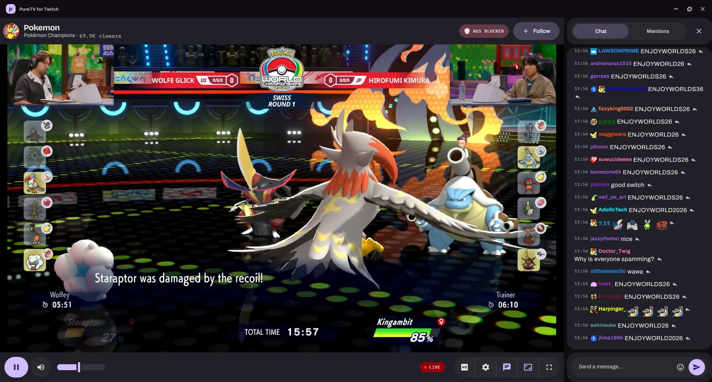
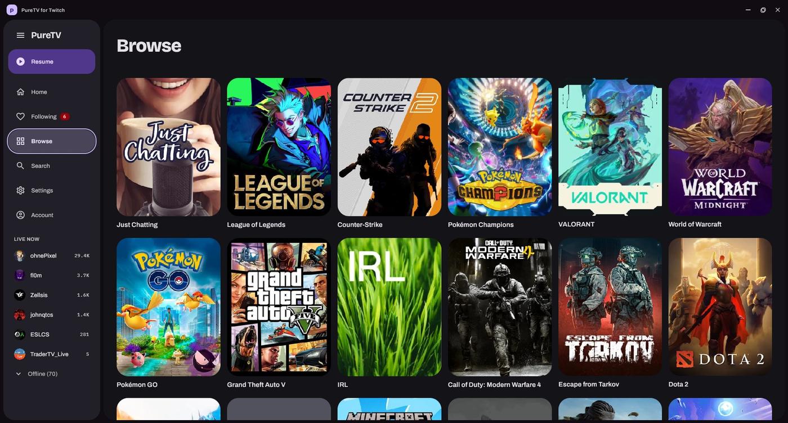
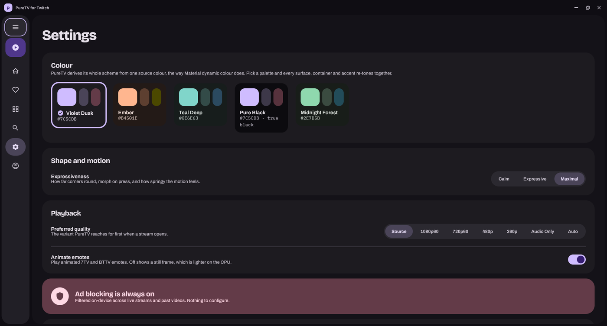
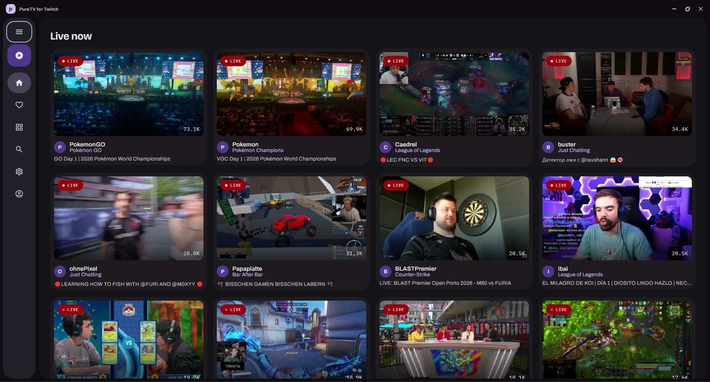
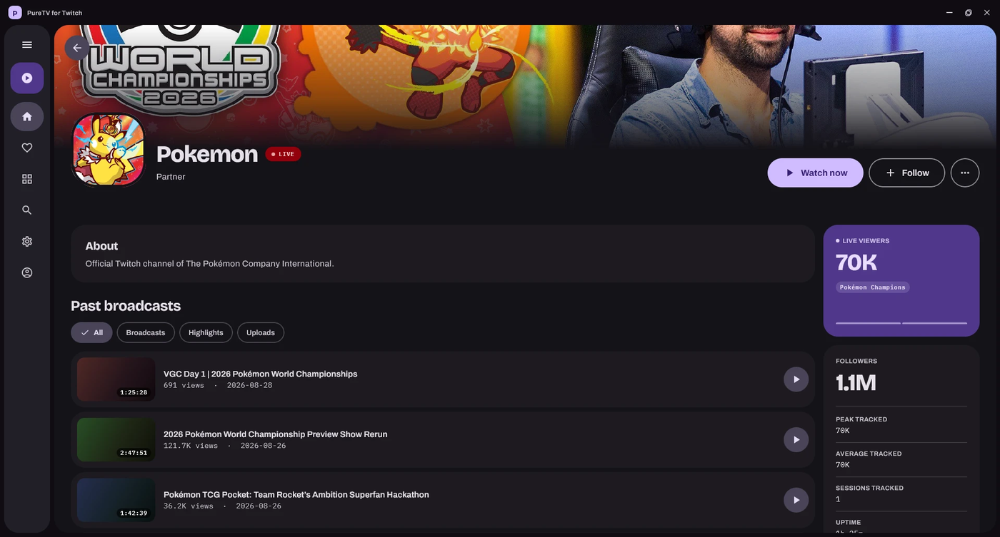
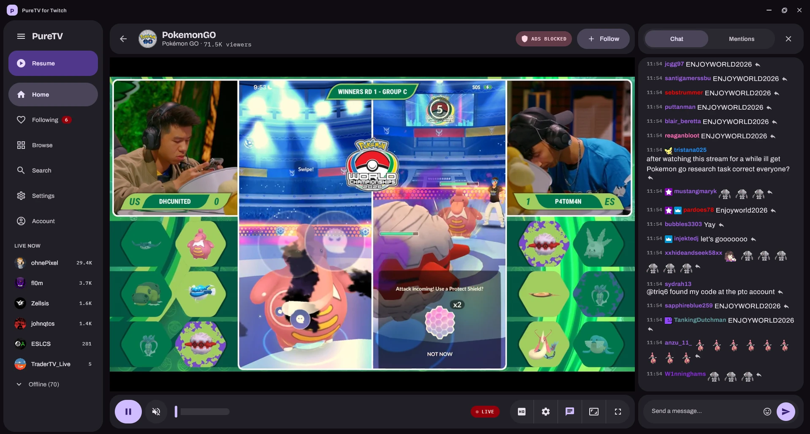

<div align="center">

<h1>PureTV</h1>

**Live streams without the ads. On your PC, your phone, and your TV.**

Ads get filtered out on your own device before the player ever sees them.
No relay server, no account with us, no logging of what you watch.

<br>

[](https://github.com/dhawal-ss/puretv/releases/latest)
[](https://github.com/dhawal-ss/puretv/releases/download/android-latest/PureTV-for-Twitch-Android.apk)
[](https://github.com/dhawal-ss/puretv/releases/download/tv-latest/PureTV-FireTV-AndroidTV.apk)

<br>



</div>

<br>

## What you get

|  | |
|---|---|
| **No ads** | Mid-rolls are stripped from the stream on your device. A small pill on the player tells you it is working. |
| **Five themes** | Violet Dusk, Ember, Teal Deep, Pure Black and Midnight Forest. Each one re-tones the whole app, not just an accent. |
| **Your follows, front and centre** | Live channels first, offline below, on every platform. |
| **Chat beside the stream** | With emotes, on all three apps. |
| **Updates itself** | It checks on launch and installs in one tap. No re-downloading. |
| **Nothing phones home** | Sign-in goes straight to Twitch. Your session stays encrypted on your device. |

<br>

<div align="center">


&nbsp;


<sub>Browse every category, and make it look how you want</sub>

<br><br>


&nbsp;


<sub>Everything live right now, and a channel's past broadcasts</sub>

<br><br>



<sub>Chat sits beside the stream, emotes and all</sub>

</div>

<br>

## Get it

<details>
<summary><b>Windows</b></summary>

<br>

1. [Download the installer](https://github.com/dhawal-ss/puretv/releases/latest) and open it.
2. If Windows shows a blue "Windows protected your PC" screen, click **More info**, then **Run anyway**. That only appears because the app is not code-signed yet.
3. Open PureTV and sign in.

Everything it needs, including the video engine, is in the installer.

</details>

<details>
<summary><b>Android</b></summary>

<br>

Sideloaded, not on the Play Store. Needs Android 8.0 or newer.

1. [Download the APK](https://github.com/dhawal-ss/puretv/releases/download/android-latest/PureTV-for-Twitch-Android.apk) on your phone and open it.
2. Android will ask to allow installs from your browser the first time. Turn it on, then tap **Install**.
3. Open PureTV, tap **Copy code**, then go to **twitch.tv/activate** and paste it.

You also get Picture-in-Picture and a fill-to-edge fullscreen that uses the whole display including the camera cutout. Double-tap the video to toggle it.

</details>

<details>
<summary><b>Android TV and Fire TV</b></summary>

<br>

A separate build with a 10-foot layout you drive entirely with the remote. It installs through the free **Downloader** app by AFTVnews.

1. Install **Downloader** on your TV, from the Amazon Appstore or Google Play, and open it.
2. First time only, your TV has to allow installs from Downloader. Fire TV prompts you. On Google TV it is under *Settings, Apps, Security & restrictions, Unknown sources*.
3. Rather than pecking out a long URL with the remote, get a short code: on your phone open **[aftv.news](https://aftv.news)**, paste the link below, and it gives you a 6 or 7 digit code. Type that into Downloader and press Go.

   ```
   https://github.com/dhawal-ss/puretv/releases/download/tv-latest/PureTV-FireTV-AndroidTV.apk
   ```

   The link is permanent, so one code keeps working for every future release.
4. Choose **Install**, then open PureTV and sign in: scan the QR with your phone, or go to **twitch.tv/activate** and type the big code on screen.

**Remote controls:** D-pad to move, Select to open, Back to go back. On a stream, Left or Right shows chat, Play/Pause pauses, and Fast-Forward or Rewind changes quality.

</details>

<br>

> [!NOTE]
> The Android and TV builds are signed with a development key, so your device will call them apps from an "unknown source". That is just how sideloading works.

<br>

## Build it yourself

Kotlin Multiplatform. A shared `core` module holds the API client, sign-in, ad-block engine and chat; each app builds its own UI on top. Windows uses Compose Multiplatform with VLC, Android and TV use Jetpack Compose with ExoPlayer.

```bash
./gradlew :app-windows:run          # desktop, needs JDK 17 and VLC
./gradlew :app-android:assembleDebug
./gradlew :app-tv:assembleDebug
```

Full setup, signing and release instructions live in **[docs/DEVELOPING.md](docs/DEVELOPING.md)**.

<br>

## License

MIT, see [LICENSE](LICENSE). Issues and pull requests are very welcome.
